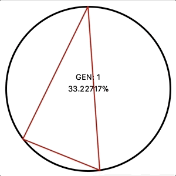
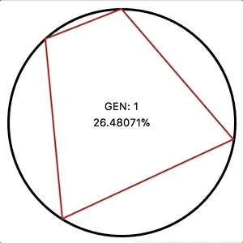
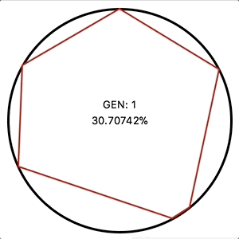

# Genetic polygons

Made by [Kishan Emens](https://github.com/phi-line), [Rix Lai](https://github.com/rixktl), and [Joshua Kuehn](https://github.com/joshuakuehn)

Made for OwlHacks Winter 2017 at Foothill College

## How does it work
This program uses the process of genetic algorithms to generate a regular polygon.
It involves a process of selection and mutation to improve the accuracy of each subsequent generation.
An animation of a single run can be viewed, or a timing run can be used to analyze the efficiency of various parameters.

|  **3 vertices**  |  **4 vertices**  |  **6 vertices**  |
|:---:|:---:|:---:|
|  |  |  |

## How to use it

### First install dependencies using pip and pipenv

`pip install pipenv`

### Run the program using the following command

`pipenv run python main.py`

## You can use the following arguments to modify the results of each run
```
usage: main.py [-h] [-v [VERTS]] [-p [POPULATION]]

optional arguments:
  -v [VERTS], --verts [VERTS]
                        How many vertices should each generation run
  -p [POPULATION], --population [POPULATION]
                        What population should each generation contain
```
